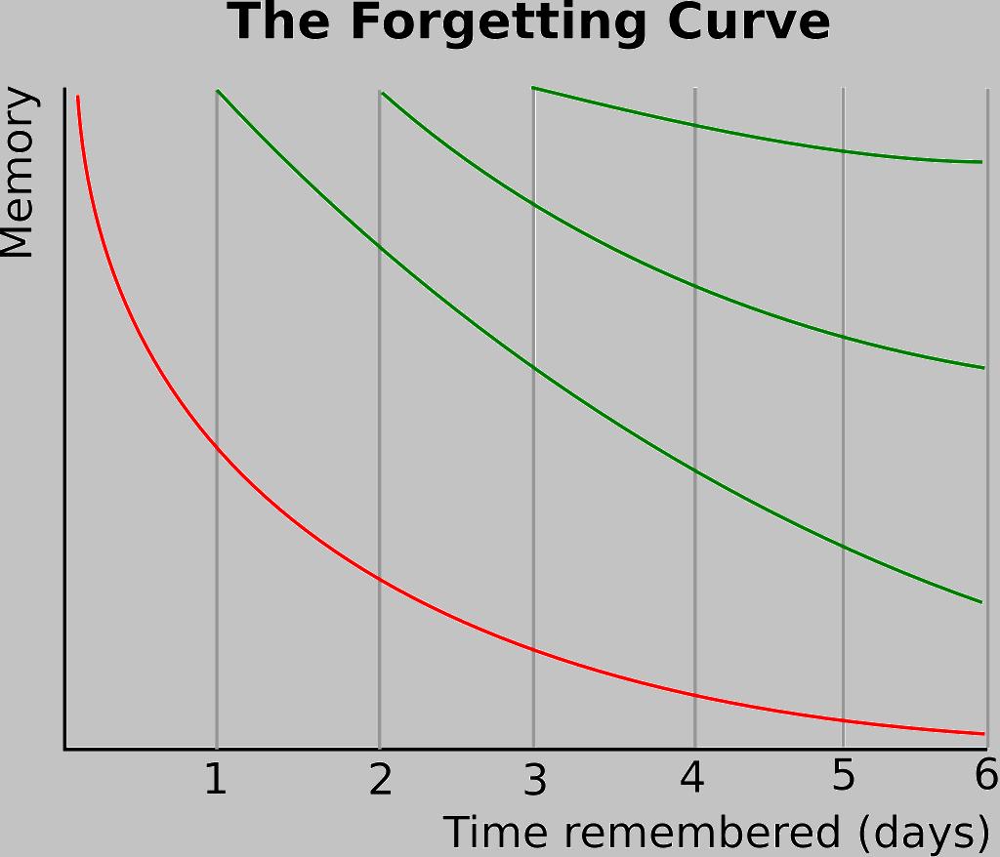

# This project isn't finished yet.

LEARN_ENGLISH_WITH_FORGETTING_CURVE
===
This Project helps users learn English by the forgetting curve, It allows users to input new vocabularies, and review them at any time.

What is the forgetting curve
===
According to the forgetting curve, non-english native speakers learn English by following the curve. This graph might be hard to understand, so refer to this table.

According to experiments, over time, memory of vocabularies declines like this.(for reference only)

| After study | percent in memory |
| :---:   | :---: |
| 20 mins | 58% |
| 1 hour | 44% |
| 9 hours | 36% |
| 1 day | 34% |
| 2 days | 28% |
| 6 days | 25% |
| 31 days | 21% |

Function
===
This project allows users to input daily new vocabularies, and following intervals of 1 day, 2 days, 6 days, and 31 days to help users review.  It also provides quiz function to help users memorize even more deeply.
